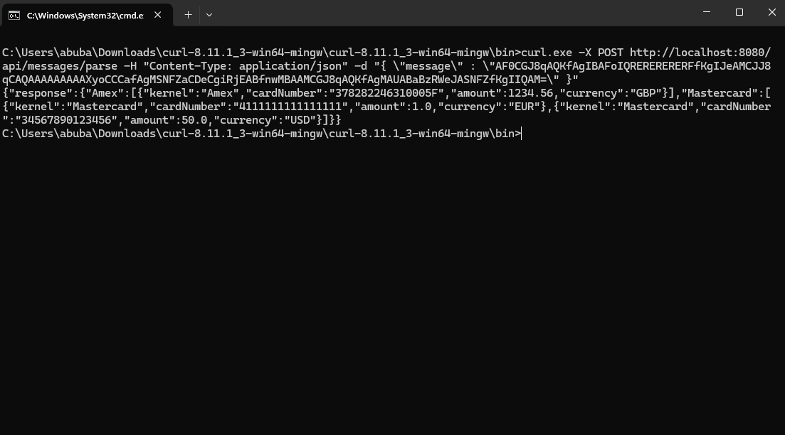

# LittlePay Application

This application processes payment messages in a custom format, decodes them, and parses them into structured data. It supports two modes of operation:
1. **Spring Boot REST API**: A RESTful service that accepts Base64-encoded messages and returns parsed results.
2. **Standalone `LittlePayServer`**: A TCP server that listens for incoming messages and processes them.

---

## Prerequisites
- Java 17 or higher.
- Maven (for building the project).
- `curl` (for testing the REST API).

---

## How to run from IDE
1. Open the project in your IDE (e.g. IntelliJ) 
2. do clean install from the maven lifecycle panel 

3. navigate to LittlePayApplication class then launch it 


## How to run with mvn cmd
1. make sure that you have mvn installed and added to environmental variables in the "Path" 

2. navigate to the unzipped/cloned project
3. execute -> mvn clean install 

4. execute -> mvn spring-boot:run


## How to test (using curl)
1. having LittlePayApplication running first
2. having curl installed 
3. open the command prompt then execute the following test cases:

Test case 1:
```
curl.exe -X POST http://localhost:8080/api/messages/parse -H "Content-Type: application/json" -d "{ \"message\": \"AEICGJ8qAQKfAgIBAFoIQRERERERERFfKgIJeAMCJJ8qCAQAAAAAAAAAXyoCCCafAgMSNFZaCDeCgiRjEABfnwMBAAM=\" }"
```
expected result:
```
{
    "response": {
        "Amex": [
            {
                "kernel": "Amex",
                "cardNumber": "378282246310005F",
                "amount": 1234.56,
                "currency": "GBP"
            }
        ],
        "Mastercard": [
            {
                "kernel": "Mastercard",
                "cardNumber": "4111111111111111",
                "amount": 1.0,
                "currency": "EUR"
            }
        ]
    }
}
```




Test case 2:
```
curl.exe -X POST http://localhost:8080/api/messages/parse -H "Content-Type: application/json" -d "{ \"message\": \"AF0CGJ8qAQKfAgIBAFoIQRERERERERFfKgIJeAMCJJ8qCAQAAAAAAAAAXyoCCCafAgMSNFZaCDeCgiRjEABfnwMBAAMCGJ8qAQKfAgMAUABaBzRWeJASNFZfKgIIQAM=\" }"
```
expected result:
```
{
    "response": {
        "Amex": [
            {
                "kernel": "Amex",
                "cardNumber": "378282246310005F",
                "amount": 1234.56,
                "currency": "GBP"
            }
        ],
        "Mastercard": [
            {
                "kernel": "Mastercard",
                "cardNumber": "4111111111111111",
                "amount": 1.0,
                "currency": "EUR"
            },
            {
                "kernel": "Mastercard",
                "cardNumber": "34567890123456",
                "amount": 50.0,
                "currency": "USD"
            }
        ]
    }
}
```


Test case 3:
```
curl.exe -X POST http://localhost:8080/api/messages/parse -H "Content-Type: application/json" -d "{ \"message\": \"ABsCGJ8qAQKfAgMAUABaBzRWeJASNFZfKgIIQAM=\" }"
```
expected result:
```
{
    "response": {
        "Mastercard": [
            {
                "kernel": "Mastercard",
                "cardNumber": "34567890123456",
                "amount": 50.0,
                "currency": "USD"
            }
        ]
    }
}
```


Test case 4:
```
curl.exe -X POST http://localhost:8080/api/messages/parse -H "Content-Type: application/json" -d "{ \"message\": \"ABsCGJ8qAQKfAgIBAFoIQRERERERERFfKgIJeAM=\" }"
```
expected result:
```
{
    "response": {
        "Mastercard": [
            {
                "kernel": "Mastercard",
                "cardNumber": "4111111111111111",
                "amount": 1.0,
                "currency": "EUR"
            }
        ]
    }
}
```

## How to test (using postman)
1. having LittlePayApplication running first
2. having postman installed
3. import "sample input-output/LittlePay.postman_collection.json" collection into postman
4. there are 4 test cases, run them one by one
5. see results in "sample input-output" folder


